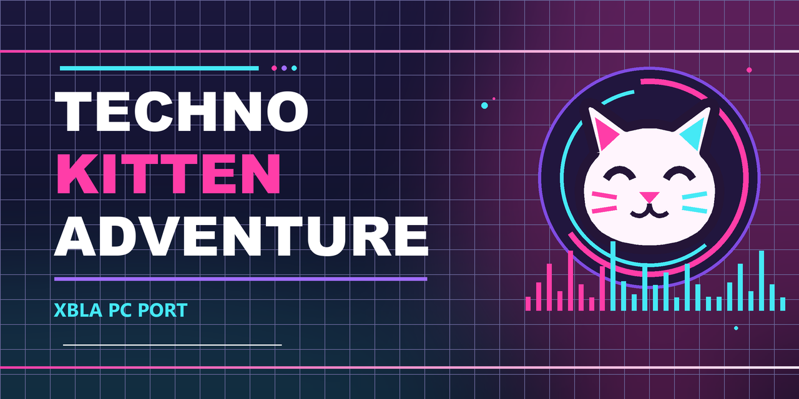

# Techno Kitten Adventure XBLA PC Recomp

An unofficial .NET 8 / MonoGame PC port of the Techno Kitten Adventure! XBLA game for Windows. Supply your own Xbox 360 package: Setup retargets its managed XNA program and converts its assets on your PC. **This is not a ReXGlue or static PowerPC recompilation.** The repository contains the port, importer and build tools, not the original game program or assets.

> **Bring your own game copy.** Setup accepts only the audited 83,353,600-byte LIVE package with header title ID `584E07D2` and SHA-256 `A472E517EF37A35A5C956C6ED558FE918F8D4E0C775995188CC17671FBB50EE5`. Other packages are rejected without replacing an installed game.

If you enjoy this project, [Ko-fi tips](https://ko-fi.com/caiuscodes) are optional. The port and its releases remain free.

## Requirements

- Windows x64 and a Direct3D 11-capable graphics card. Windows 11 has been tested; other systems need testing.
- Your own supported Techno Kitten Adventure Xbox 360 package, identified above.
- A writable folder for Setup and the portable game. The release carries its .NET runtime; no separate .NET installation is needed.

## Install and play

1. Download `Techno-Kitten-Adventure-XBLA-PC-Recomp-v1.0.3.zip` from the future [Releases](https://github.com/CaiusCodes/Techno-Kitten-Adventure-XBLA-PC-Recomp/releases) page, then extract the **whole ZIP** to a writable folder.
2. Run `Setup Techno Kitten Adventure.exe` and select your legally obtained package.
3. Choose **Install game**, then **Play now**. Later, run `Techno Kitten Adventure.exe` beside Setup.

Keep the `resources` folder beside Setup. After installation, the top-level play EXE launches the managed game in `Game/`. Converted assets and the .NET/MonoGame runtime live there; saves and display settings stay in `Game/userdata/`. Move or back up the complete extracted folder to keep everything together.

Setup reads your package without modifying it and does not download game data. Reinstalling from the same supported package preserves `Game/userdata/`, retains a backup of the previous installation, and migrates the older `TechnoKittenAdventure.exe` filename. Do not share an installed `Game/` folder because it contains data from your copy.

## Features

- Native Windows host for the original game's menus and gameplay, with local package import.
- Windowed or borderless fullscreen output at 1280×720, 1920×1080, 2560×1440 or 3840×2160. The image retains its 16:9 proportions.
- Internal 2× rendering by default, independent of the output size. Game updates use fixed 60 Hz timing; VSync is off by default.
- Portable saves and display settings. The Press Start screen shows the build version.

### Keyboard mapping

| Key | Current action |
| --- | --- |
| S | Start or pause |
| Space | Select or fly |
| B | Back or resume |
| Arrow keys | Navigate menus |

Scripted input checks exercise these mappings. Physical keyboards and controllers still need broader hardware testing; no mouse control or remapping feature is claimed.

## Known limitations

- Only the exact package hash above is supported. No separate DLC package has been audited or imported.
- The game's music-spectrum visualization remains inactive. VSync and FPS-display controls are not in the native Options menu.
- Longer sessions, physical controllers, other Windows versions and additional GPUs need testing.
- Installer updates preserve saves transactionally, but the original game's own save writes are not crash-atomic.

If something fails, report the version, Windows version, GPU, stage and steps to reproduce. Check logs for personal paths before sharing an excerpt. Never attach a game package, converted assets or saves.

## For developers

The installer is built from `src/` and `tools/` with pinned .NET and MonoGame dependencies, CMake and Visual Studio C++ tools. [Build instructions](docs/BUILD-V1.md) list the exact tool versions and commands. `tools/Build-Installer.ps1` builds an asset-free Setup, and `tools/Package-Installer.ps1` creates the release ZIP. `VERSION` is the release version; source packages use an explicit file allowlist.

The original program is converted locally at install time. The managed IL bridges verify its full SHA-256 and exact method signatures before writing a separate game DLL. `XenosRecomp` translates shader instructions from the user's package during import; it does **not** recompile this game's CPU code. See the [technical handoff](docs/V1.md), [version-badge notes](docs/BUILD-BADGE.md) and [release notes](RELEASE_NOTES.md). Generated game-derived files belong only in private build or installed folders.

## Licence and credits

Original port code and the new cat/banner artwork are under the [MIT licence](LICENSE). The .NET runtime, MonoGame, Mono.Cecil, SharpDX, XenosRecomp and its compiler dependencies retain their own terms; see [third-party notices](THIRD_PARTY.md) and `packaging/licenses/`.

Techno Kitten Adventure!, Xbox and Xbox 360 belong to their respective owners. The MIT licence grants no rights to the original game, its assets or trademarks. This is an unofficial project with no affiliation or endorsement.
