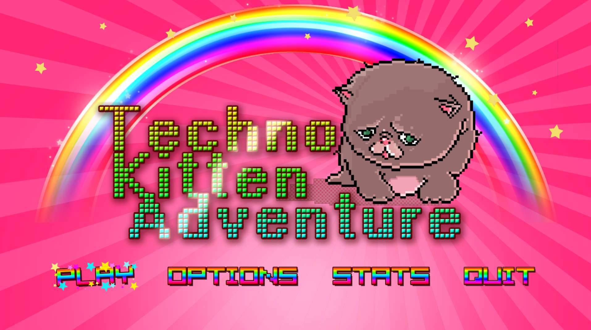
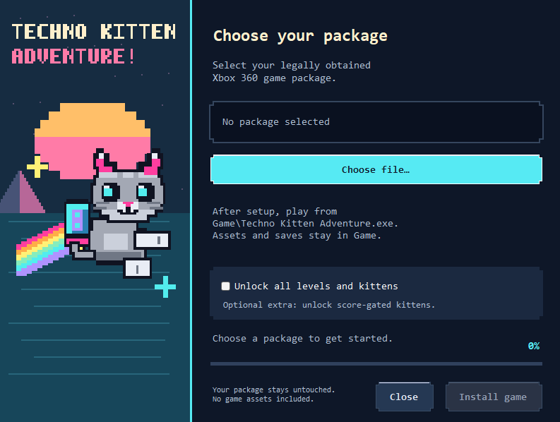
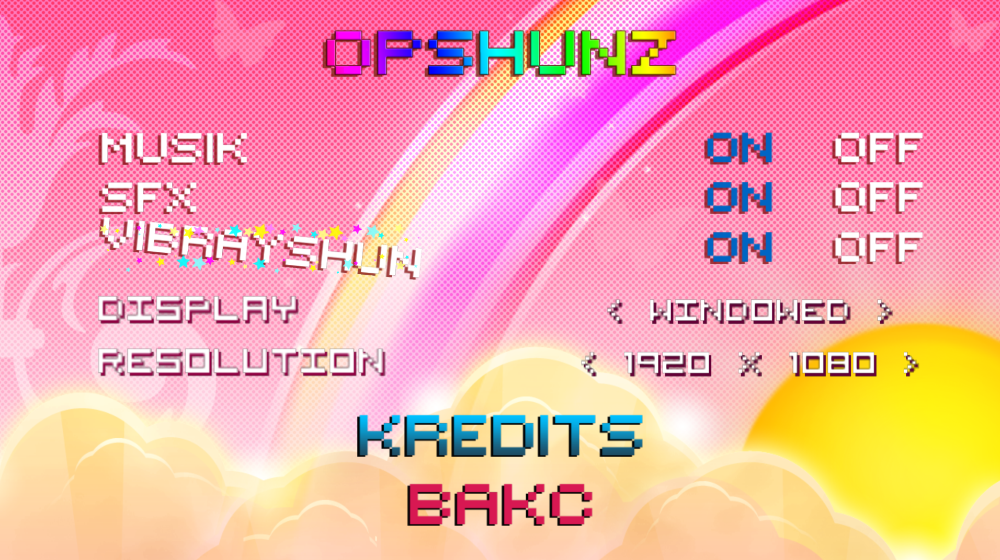
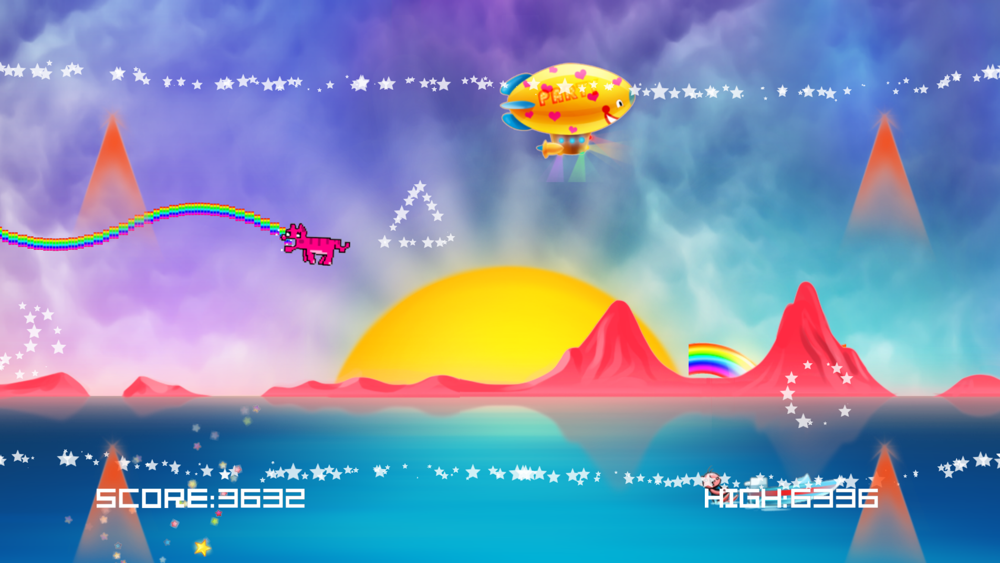
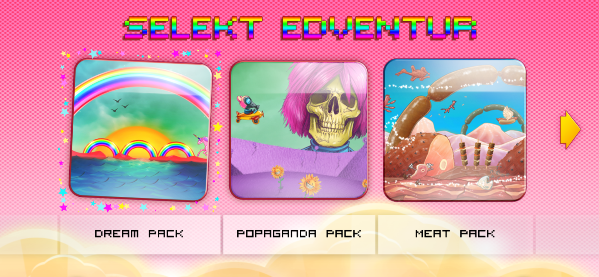
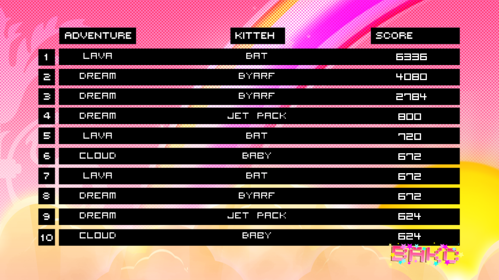

# Techno Kitten Adventure XBLA PC Recomp

An unofficial Windows PC port of **Techno Kitten Adventure!**, built with .NET 8 and MonoGame. Enjoy the original XBLA Indie game with mouse navigation, PC display options and portable saves.

> **You'll need your own supported Xbox 360 game package.** Setup checks your file and prepares the game on your PC. The player download contains no original game program or assets.

If you'd like to support future projects, you can leave an optional [Ko-fi tip](https://ko-fi.com/caiuscodes).



## Requirements

- Windows x64 and a Direct3D 11-capable graphics card. Windows 11 has been tested.
- Your own supported Techno Kitten Adventure! Xbox 360 package.
- A short writable folder for Setup and the game. No separate .NET installation is needed.

<details>
<summary>Which game package is supported?</summary>

Setup currently accepts one verified **83,353,600-byte LIVE package**, with header title ID `584E07D2` and this SHA-256:

```text
A472E517EF37A35A5C956C6ED558FE918F8D4E0C775995188CC17671FBB50EE5
```

Other revisions, repacked packages, loose extracted files and separate DLC packages are not supported. Setup rejects unsupported files without replacing an installed game.

</details>

## Install and play

1. Download **`Techno-Kitten-Adventure-XBLA-PC-Recomp-v0.9.0.zip`** from [Releases](https://github.com/CaiusCodes/Techno-Kitten-Adventure-XBLA-PC-Recomp/releases).
2. Extract the **Techno Kitten Adventure XBLA Recomp** folder to a short, writable location.
3. Open **`Setup Techno Kitten Adventure.exe`** and choose your game package.
4. If you'd like the score-gated kittens unlocked, tick **Unlock all levels and kittens**. Then choose **Install game**, followed by **Play now**.



Next launch **`Game/Techno Kitten Adventure.exe`**. All five stages are already available in full mode; the optional extra unlocks the kittens normally earned through high scores.

Setup leaves your original package untouched and downloads no game data. Saves and display settings stay in `Game/userdata/`. Reinstalling preserves them and keeps a backup of the previous installation. Move or back up the complete extracted folder to keep everything together. Please don't share the installed `Game/` folder, since it contains data from your copy.

### Why is the download about 170 MB?

The v0.9.0 ZIP is **169.6 MB (161.8 MiB)** because it includes the .NET 8 runtimes, MonoGame and the conversion tools used during setup. A small importer may rely on software already installed on your PC; this release carries its dependencies with it. The extra size comes from those tools, not game assets. Installation takes more space after extraction and conversion.

## Features

- Mouse navigation in menus, including clickable display options and level-select arrows.
- Keyboard controls alongside the original gamepad controls.
- Windowed or borderless fullscreen at 720p, 1080p, 1440p or 4K, with the original 16:9 proportions preserved.
- 2x internal rendering by default, independent of output size; fixed 60 Hz game updates and VSync off by default.
- Portable saves and display settings, plus a small build label on the title screen.
- Controller Select/Back prompts and flight instructions shown only while a gamepad is connected.



## Controls

| Input | Action |
| --- | --- |
| Arrows / WASD | Navigate menus |
| Space | Select; hold to fly up, release to descend |
| Enter | Start in menus |
| Esc | Back in menus; pause during play |
| S | Original Start / pause shortcut |
| B | Back / resume |
| Left click | Advance from Press Start; select in menus |
| Right click | Back in menus |

Move the mouse over menu items to highlight them. The cursor appears on the title screen and in menus, including pause, and hides during active play.

## Known limitations

- Only the package listed above is supported.
- Deeply nested installation paths can stop Windows from launching the conversion tool.
- More testing is welcome on different GPUs, Windows versions, physical controllers and longer sessions.
- Setup preserves saves during reinstall, but the game's own save writes can still be interrupted by a crash.

Found a problem? Please [open an issue](https://github.com/CaiusCodes/Techno-Kitten-Adventure-XBLA-PC-Recomp/issues) with your build version, Windows version, GPU, input device and the steps to reproduce it. Check `Game/logs/` for personal paths before sharing excerpts. Please don't attach game packages, converted assets or saves.

## Screenshots




Game artwork in these captures remains the property of its owners; see the [screenshot notice](docs/screenshots/NOTICE.md).

## For developers

Despite the established repository name, this is a **managed .NET / MonoGame PC port**, not a ReXGlue or static PowerPC recompilation. Setup retargets the original XNA program and converts assets locally. Its patches check the original program's hash and exact method signatures. XenosRecomp handles shader translation, not the game's CPU code.

See the [build instructions](docs/BUILD-V1.md) for pinned dependencies and commands, the [technical handoff](docs/V1.md) for implementation details, and [release notes](RELEASE_NOTES.md) for changes. `VERSION` controls release numbering. Build and packaging tools live in `tools/`; generated game files stay private.

## Licence and credits

Original port code and the new cat/banner artwork use the [MIT licence](LICENSE). .NET, MonoGame, Mono.Cecil, SharpDX, XenosRecomp and their dependencies keep their own licences; see [third-party notices](THIRD_PARTY.md).

Techno Kitten Adventure!, Xbox and Xbox 360 belong to their respective owners. The port's licence grants no rights to the original game, its assets or trademarks. This is an unofficial fan project with no affiliation or endorsement.
